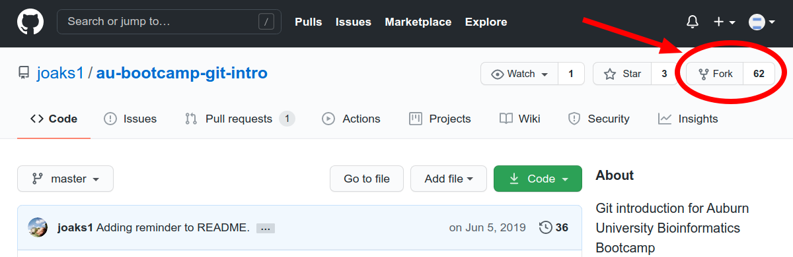
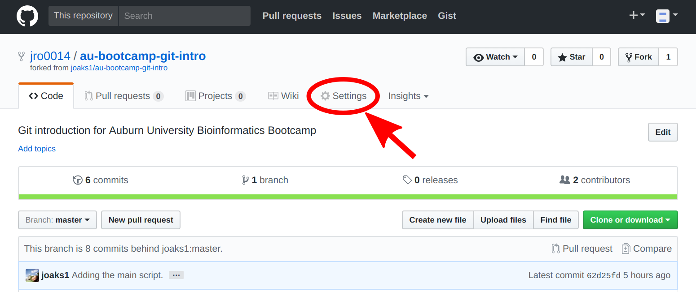
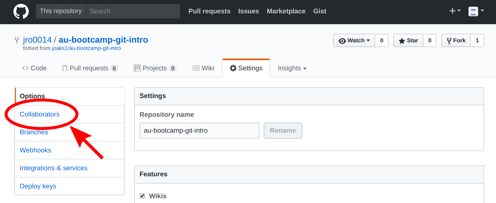
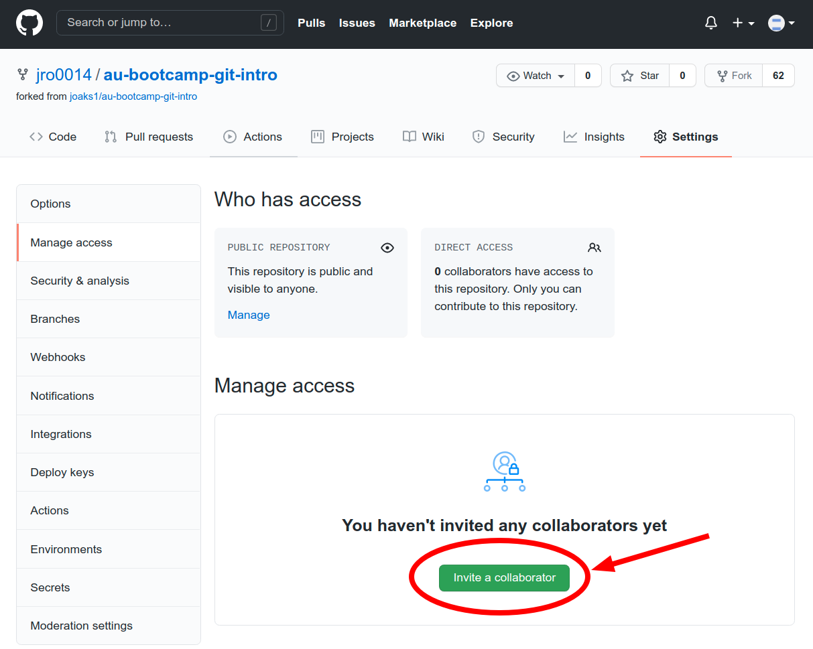
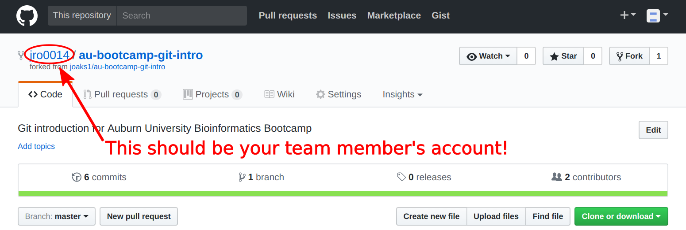
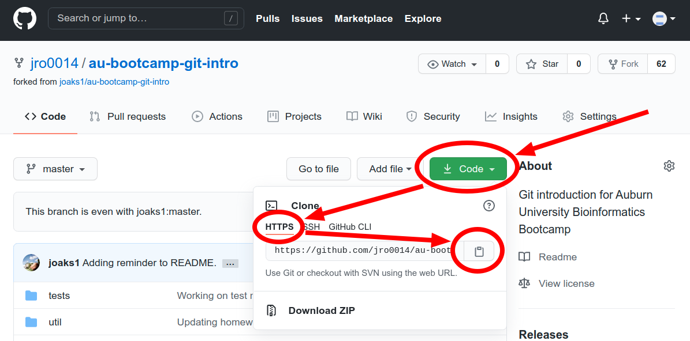

# Introduction

The purpose of this exercise is to introduce the participants of the [Auburn
University Bioinformatics
Bootcamp](http://www.auburn.edu/cosam/bioinformatics/) to using
[Git](https://git-scm.com/) to version control their science!

# Contents

-   [Getting set up](#getting-set-up)
-   [Exercise](#exercise)
    -   [The goal](#the-goal)
    -   [The script](#the-script)
        -   [Input](#input)
        -   [Output](#output)
        -   [Examples](#examples)
        -   [Some hints to get you coding](#some-hints-to-get-you-coding)
-   [Acknowledgments](#acknowledgments)
-   [License](#license)

# Getting set up

At this point, you should have
(1) an account on [Github](https://github.com/),
(2) been introduced to the very basics of [Git](https://git-scm.com/),
and (3) be working in a group with about 3 other people.

1.  All of you should login to your [Github](https://github.com/) account.

1.  **One** of you should fork
    [this repository](https://github.com/joaks1/au-bootcamp-git-intro), by
    clicking the 'Fork' button on the upper right of the page.

    

    After a few seconds, the team member that forked should be looking at their
    copy of the repo in their Github account.

1.  Next, the person that forked the repo needs to add their team members as
    collaborators:

    1.  Click the 'Settings' tab near the top of the page.

        

    2.  Click 'Manage access' in the settings menu along the left.

        

    3.  Click the 'Invite a collaborator' button.

        

    4.  You should be able to find your team members' accounts by searching for
        their Github **username**.

1.  Each team member that is added will receive an invitation via e-mail to
    collaborate on the repo. Accept the invitation and follow the link to
    the forked repo on your team member's Github account.

1.  At this point, you should all be on the Github page of your team's forked
    repo. Make sure you are on the page of your **team member's** forked repo,
    **NOT** my copy of the repo (see image below).

    

1.  Click the 'Code' button. From the dropdown, make sure 'HTTPS' is selected
    and copy the URL of the repo via the 'copy to clipboard' button. (**ALL**
    team members need to do this, including the one who forked the repo)

    

1.  In your terminal, navigate to where you want to keep this repo (you can
    always move it later, so just your home directory is fine). Then type:

        $ git clone <the-url-you-just-copied>

    and hit enter to clone the repository.

1.  Next, `cd` into the directory:

        $ cd <the-name-of-directory-you-just-cloned>

1.  At this point, all members of your team should be in their own local copy
    of the repository.

    Each of you now has your very own *local* copy of the repository, and can
    `pull` and `push` changes from and to the *remote* copy of the repo hosted
    on Github.

    Note, there is nothing special about the *remote* copy. It is just like the
    *local* copy of the repo you have. The only difference is that it is
    located in a place you can all access (on a Github server).
    This is what it means when we say Git is distributed; everyone has
    a full copy of the entire repo!

# Exercise

## The goal

The goal of this exercise is for you to work collaboratively with your team
members to write a simple shell script.

Type `ls` in the directory of the repo you just cloned. You should see
something like:

    $ ls
    count-fasta-seqs.sh
    example-seqs1.fasta
    example-seqs2.fasta
    LICENSE.txt
    README.md
    run_tests.sh
    tests
    util
    
The file `count-fasta-seqs.sh` is where you will write your shell script.  Go
ahead and open it with your preferred text editor (probably `nano` if you are
working on the Alabama Super Computer and have become familiar with the `nano`
during the Bioinformatics Bootcamp).
You will see that the file is mostly just filled with comments (i.e., there's
no code). 

The file `run_tests.sh` is a script that runs a series of tests on the
`count-fasta-seqs.sh` script. Since that code doesn't exist yet, all of these
tests currently fail. Try it:

    $ sh run_tests.sh
    
    ----------------------------------------------------------------------
    RUNNING TEST:
      sh count-fasta-seqs.sh gekko-mindorensis.fasta
    
    *****************************************
    FAIL: Did not create the expected output!
    *****************************************
    Here is the expected output:
    19 gekko-mindorensis.fasta
    19
    -----------------------------------------
    Here is the observed output:
    gekko-mindorensis.fasta
    *****************************************
    
    Passed 0 out of 1 tests
    ----------------------------------------------------------------------
    
    
    ----------------------------------------------------------------------
    RUNNING TEST:
      sh count-fasta-seqs.sh cyrtodactylus-philippinicus.fasta gekko-mindorensis.fasta insulasaurus-arborens.fasta
    
    *****************************************
    FAIL: Did not create the expected output!
    *****************************************
    Here is the expected output:
    20 cyrtodactylus-philippinicus.fasta
    19 gekko-mindorensis.fasta
    32 insulasaurus-arborens.fasta
    71
    -----------------------------------------
    Here is the observed output:
    cyrtodactylus-philippinicus.fasta gekko-mindorensis.fasta insulasaurus-arborens.fasta
    *****************************************
    
    Passed 0 out of 1 tests
    ----------------------------------------------------------------------
    
    
    ----------------------------------------------------------------------
    RUNNING TEST:
      sh count-fasta-seqs.sh /home/jamie/Dropbox/projects/au-bootcamp-git-intro/tests/test_nested_singleton/input/gekko-mindorensis.fasta
    
    *****************************************
    FAIL: Did not create the expected output!
    *****************************************
    Here is the expected output:
    19 gekko-mindorensis.fasta
    19
    -----------------------------------------
    Here is the observed output:
    /home/jamie/Dropbox/projects/au-bootcamp-git-intro/tests/test_nested_singleton/input/gekko-mindorensis.fasta
    *****************************************
    
    Passed 0 out of 1 tests
    ----------------------------------------------------------------------
    
    
    ----------------------------------------------------------------------
    RUNNING TEST:
      sh count-fasta-seqs.sh /home/jamie/Dropbox/projects/au-bootcamp-git-intro/tests/test_nested_files/input/*
    
    *****************************************
    FAIL: Did not create the expected output!
    *****************************************
    Here is the expected output:
    20 cyrtodactylus-philippinicus.fasta
    19 gekko-mindorensis.fasta
    32 insulasaurus-arborens.fasta
    71
    -----------------------------------------
    Here is the observed output:
    /home/jamie/Dropbox/projects/au-bootcamp-git-intro/tests/test_nested_files/input/cyrtodactylus-philippinicus.fasta /home/jamie/Dropbox/projects/au-bootcamp-git-intro/tests/test_nested_files/input/gekko-mindorensis.fasta /home/jamie/Dropbox/projects/au-bootcamp-git-intro/tests/test_nested_files/input/insulasaurus-arborens.fasta
    *****************************************
    
    Passed 0 out of 1 tests
    ----------------------------------------------------------------------
    
    
    Some tests failed (see messages above)

Four tests were run and, as expected, they all failed.
Your goal is to work collaboratively with your team members to add shell code
to `count-fasta-seq.sh` until these tests pass.

**NOTE: You do NOT need to know how the tests work! You only need to add code
to count-fasta-seq.sh (more on what that entails in the next section!)**

Make sure you are working together by sharing (`pushing` and `pulling`) your
code as you go via Git.

## The script

Now, you need to know what the failing tests expect `count-fasta-seqs.sh` to be
doing!
Below, is some info about what this script should do, including what the inputs
and output should be:

### Input

Paths to one or more fasta sequence files.
    
### Output

For each file, it should write a line with the number of sequences in the file,
a space, and then the file NAME (NOT the path!), and a final line with the
total number of sequences across all files.
    
### Examples

In the same directory as this script, you should find an example fasta file
named 'example-seqs1.fasta', which contains:

    >RMB3263_Cyrtodactylus_philippinicus_Negros
    CGGGCCCATACCCCGAAAATGTTGGTATAAACCCCTTCCTATACTAATAAACCCCATTATTTGATCACTATTACTAAC
    
    >CWL052_Cyrtodactylus_philippinicus_Negros
    CGGGCCCATACCCCGAAAATGTTGGTATAAACCCCTTCCTATACTAATAAACCCCATTATTTGATCACTATTACTAAC

If you run this script on this fasta file like this

    $ sh count-fasta-seqs.sh example-seqs1.fasta

you want to get the following output:

    2 example-seqs1.fasta
    2

There should be another example fasta file named 'example-seqs2.fasta', which
contains:

    >RMB7155_Sphenomorphus_arborens_Negros
    ATGAACCCCATTATAACCTCCCTCATTTTATCAAGCCTGGCCCTTGGAACCGTAATCACACTAACAAGCTACCACTGA
    
    >RMB7156_Sphenomorphus_arborens_Negros
    ATGAACCCCATTATAACCTCCCTCATTTTATCAAGCCTGGCCCTTGGAACCGTAATCACACTAACAAGCTACCACTGA
    
    >RMB7163_Sphenomorphus_arborens_Negros
    ATGAACCCCATTATAACCTCCCTCATTTTATCAAGCCTGGCCCTTGGAACCGTAATCACACTAACAAGCTACCACTGA

If you run this script on BOTH fasta files, you want to get the
following output:

    $ sh count-fasta-seqs.sh example-seqs1.fasta example-seqs2.fasta
    2 example-seqs1.fasta
    3 example-seqs2.fasta
    5

### Some hints to get you coding

The first thing you need to be able to do is access the paths to the fasta
files that are 'given to' this script. The variable `$@` will be very useful
for this. Currently, the only thing `count-fasta-seqs.sh` does is:

    echo "$@"

What does this do? Try this:

    $ sh count-fasta-seqs.sh larry curly moe

What is the output? It's just listing the arguments given to the script! Now
try:

    $ sh count-fasta-seqs.sh example-seqs1.fasta example-seqs2.fasta

Hmmm... That output seems like it might be useful in your script?
Now, you need to figure out how to work with each argument.
**HINT:** for loop (remember "for do done"?). Something like:

    for filepath in "$@"
    do
        YOUR CODE HERE
    done

just might get you started.

You will also need to get only the name of each file from the path. Checkout
the command 'basename' for this:

    $ man basename

To count the number of sequences in each file, I recommend you checkout
`grep` and `wc`:

    $ man grep
    $ man wc

**WARNING** about `grep`: ALWAYS quote the string that you are trying to find!
For example, do:

    $ grep "string I want to find" file-i-want-to-find-it-in.txt

**NOT**

    $ grep string I want to find file-i-want-to-find-it-in.txt # DON'T DO THIS!

To keep a tally of the total number of sequences across all files, `expr`
might be useful:

    $ man expr

**REMEMBER**: The goal of this exercise is to use git. Don't forget to commit
and pull/push often.

Good luck!

# Acknowledgments

## Material
This exercise was inspired by, and borrowed heavily from, the Git exercise
written by [Mark Holder](http://phylo.bio.ku.edu/content/mark-t-holder), which
can be found at <https://github.com/mtholder/swc-tree-support-ex>.

## Support
This work was made possible by funding provided to [Jamie
Oaks](http://phyletica.org) from the National Science Foundation (DEB 1656004).

# License

 This work is licensed under a <a rel="license" href="http://creativecommons.org/licenses/by/4.0/deed.en_US">Creative Commons Attribution 4.0 International License</a>.
